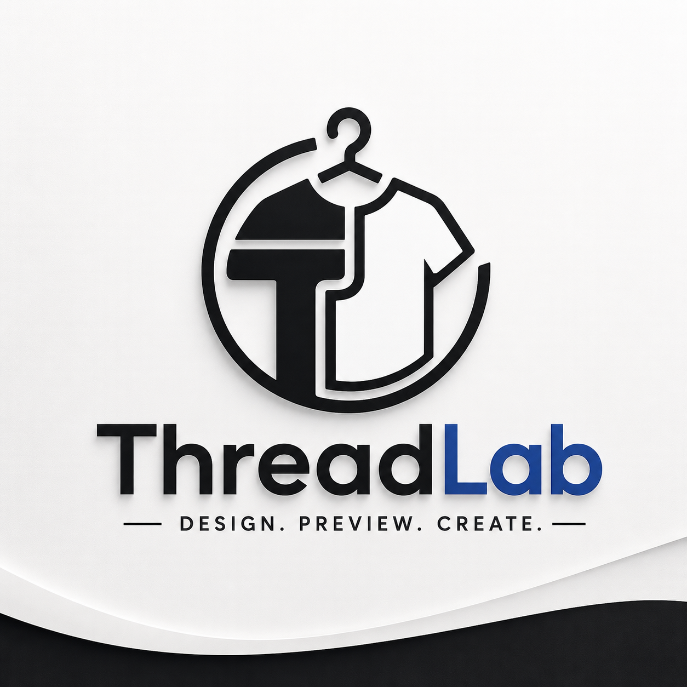

# 🧵 ThreadLab — 3D T-Shirt Design Studio


<p align="center">
  
</p>

🚀 ThreadLab is a browser-based 3D T-Shirt design studio that allows users to create, customize, and preview apparel designs in real-time using WebGL.

🔗 Live Demo: https://abdo-omran2206.github.io/ThreadLab/

---

## ✨ Features

- 🎨 Real-time T-Shirt color customization  
- 🖼️ Upload logos and images (PNG, JPG, WEBP)  
- ✍️ Add and style text on shirts  
- 🔄 3D rotation, zoom, and camera controls  
- 📸 Export high-quality PNG images (up to 4× resolution)  
- 🎥 Export 360° turntable videos (WebM)  
- 📦 Export 3D models (GLB format)  
- 💾 Auto-save projects in browser  
- ⚡ Smooth real-time rendering (60 FPS)

---

## 🧠 Tech Stack

- Three.js (WebGL rendering)
- Vanilla JavaScript
- HTML5 + CSS3
- Canvas API
- MediaRecorder API
- GLTFLoader / GLTFExporter

---

## 📁 Project Structure

```

ThreadLab/
│── index.html
│── manifest.json
│
├── assets/
│   ├── logo.png
│   └── models/
│       └── oversized_t-shirt.glb
│
├── css/
│   ├── landing.css
│   └── main.css
│
├── js/
│   ├── scene.js
│   ├── main.js
│   ├── modelLoader.js
│   ├── textureManager.js
│   ├── uiController.js
│   ├── exportEngine.js
│   └── stateManager.js
│
└── Studio/
    ├── index.html

````

---

## 🚀 Getting Started

### Clone repository
```bash
git clone https://github.com/abdo-omran2206/ThreadLab.git
````

### Open project

```bash
cd ThreadLab
```

### Run locally

* Use VS Code Live Server
* OR open `index.html` directly in browser

---

## 📦 Deployment

This project is deployed using GitHub Pages:

[https://abdo-omran2206.github.io/ThreadLab/](https://abdo-omran2206.github.io/ThreadLab/)

---

## 🎯 Purpose

ThreadLab replaces heavy design tools with a fast, interactive 3D browser experience for apparel designers, print-on-demand sellers, and creators.

---


## 👨‍💻 Author

Abdo Omran
GitHub: [https://github.com/abdo-omran2206](https://github.com/abdo-omran2206)

